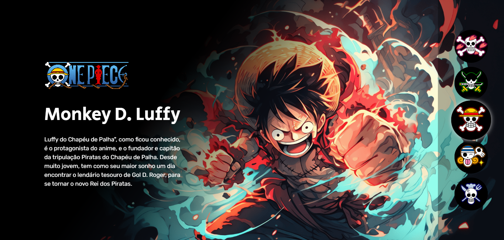
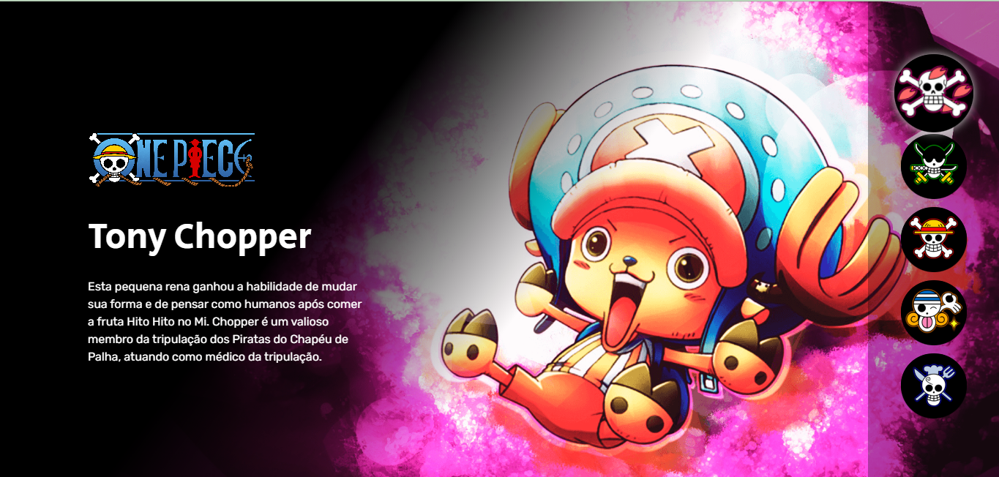

# One Piece - Semana do Zero ao Programador Contratado
Este repositório contém uma página web simples sobre alguns dos personagens do anime/mangá One Piece. 

## Descrição
O projeto inclui HTML, CSS e JavaScript para criar uma interface dinâmica onde os detalhes dos personagens são exibidos quando os botões correspondentes são clicados.

## Capturas de Tela
*Página Inicial*

## Tecnologias Utilizadas

- **HTML:** Estrutura básica da página web.
- **CSS:** Estilização e layout da página.
- **JavaScript:** Manipulação interativa dos elementos da página.

## Desenvolvimento

Este projeto foi desenvolvido como parte do curso "Do Zero ao Programador Contratado". A seguir, descrevemos a lógica por trás do código JavaScript utilizado para alcançar os objetivos definidos.
 OBJETIVO 1 - quando clicar no botão do personagem na lista, marcar o botao como selecionado 
        passo 1 - pegar os botões no JS pra poder verificar quando o usuário clicar em cima de um deles
        passo 2 - adicionar a classe "selecionado" no botão que o usuário clicou
        passo 3 - verificar se já existe um botão selecionado, se sim, devemos remover a seleção dele 

	OBJETIVO 2 - quando clicar no botão do personagem mostrar as informações do personagem
        passo 1 - pegar os personagens no JS pra poder mostrar ou esconder ele
        passo 2 - adicionar a classe "selecionado" no personagem que o usuário selecionou
        passo 3 - verificar se já existe um personagem selecionado, se sim, devemos remover a seleção dele 
*/
ChatGPT
markdown
Copy code
## Desenvolvimento

Este projeto foi desenvolvido como parte do curso "Do Zero ao Programador Contratado". A seguir, descrevemos a lógica por trás do código JavaScript utilizado para alcançar os objetivos definidos.

OBJETIVO 1 - quando clicar no botão do personagem na lista, marcar o botao como selecionado 
        passo 1 - pegar os botões no JS pra poder verificar quando o usuário clicar em cima de um deles
        passo 2 - adicionar a classe "selecionado" no botão que o usuário clicou
        passo 3 - verificar se já existe um botão selecionado, se sim, devemos remover a seleção dele 
OBJETIVO 2 - quando clicar no botão do personagem mostrar as informações do personagem
        passo 1 - pegar os personagens no JS pra poder mostrar ou esconder ele
        passo 2 - adicionar a classe "selecionado" no personagem que o usuário selecionou
        passo 3 - verificar se já existe um personagem selecionado, se sim, devemos remover a seleção dele
  
